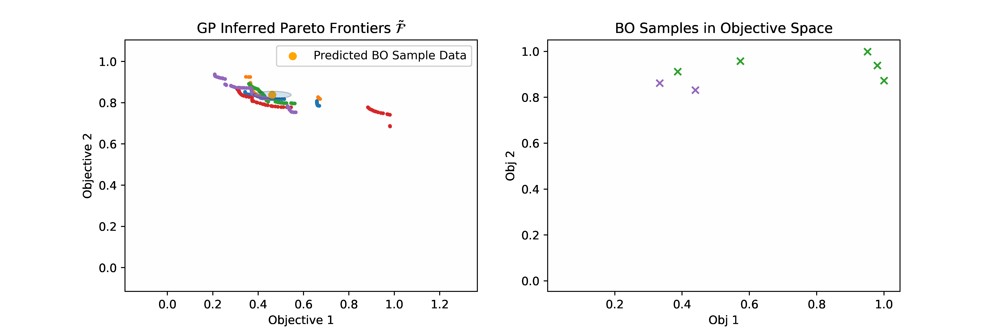

# \{PF\} $^2$ ES: A New Acquisition Function for Parallel Feasible Pareto Frontier Entropy Search


### Installation
:exclamation::exclamation::exclamation:Caution: You are away from [the main branch of Trieste](https://github.com/secondmind-labs/trieste), this branch contains certain other dependencies  

install from sources, run
```bash
$ pip install -e.
```
in the repository root (tested with Python version 3.7.11).

### Tutorial/Demonstration Notebook
There is a tutorial notebook `multi_objective_entropy_search_via_PF2ES.py` at (`\docs\notebooks`) demonstrating 
how to make use of the acquisition function for different multi-objective optimization tasks.
 
  
  In order to run the notebook, install the following dependency:     
  ``` 
  $ pip install -r notebooks/requirements.txt
  ```  

  Then, run the notebooks with  
   ```
  $ jupyter-notebook notebooks
  ```
  --------------

### Reproduce the paper's result
If you'd like to reproduce the paper's result exactly, the following directories contain relevant experiments:


- `docs\exp\unconstraint_exp` MOO Experiments
- `docs\exp\constraint_exp` Constraint MOO Experiments
- For other information-theoretic acquisitions utilized in experimental comparison, please refer their branch:
  - PESMO: https://github.com/HIPS/Spearmint/tree/PESM
  - MESMOC+: https://github.com/fernandezdaniel/Spearmint
  - PPESMOC: https://github.com/EduardoGarrido90/spearmint_ppesmoc
  
